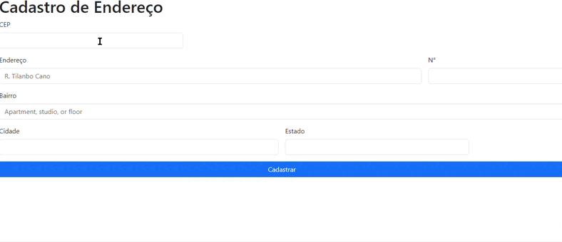
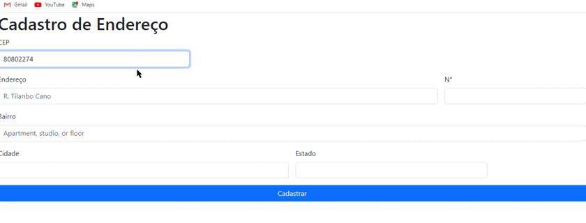
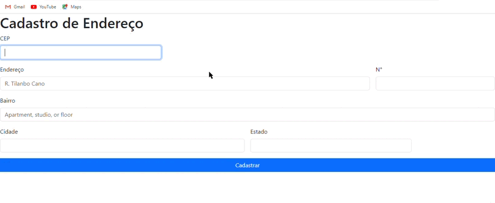
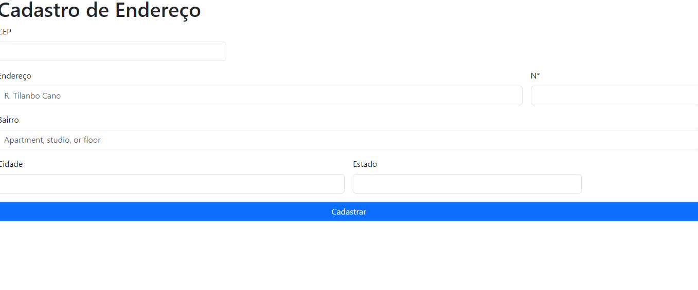

# Form-cadEndereco

##introdução
## descrição
Este código HTML cria um formulário de cadastro de endereço usando a biblioteca Bootstrap para estilos. O formulário inclui campos para inserir o CEP, endereço, número, bairro, cidade e estado. Um botão "Cadastrar" está presente para enviar o formulário.
Com o 
//add imagem da fonte bootrap5
https://getbootstrap.com/docs/5.0/layout/gutters/

## funcionalidades
1° fun. A funcionalidade principal dessa aplicação é a busca por CEP usando JavaScript. Para isso, basta digitar o CEP e os campos serão preenchidos automaticamente.

2°Se o CEP for digitado errado, a aplicação deve exibir um aviso na tela informando o usuário que o CEP é incorreto. Isso ajudará o usuário a corrigir o CEP e obter os resultados corretos.

3° Se o CEP for inválido, ou seja, não atender ao formato de 8 dígitos numéricos, ou não estiver nos servidores da Viacep, a aplicação deve exibir uma mensagem dizendo "CEP não encontrado"

4° se voce não souber o seu CEP não tem problema. simplesmente digite os numero da sua casa, endereço, bairro, cidade, Estado

### funcionalidades dos codigos principais dentro da aplicaçao 

 

`async`

A palavra-chave async indica que a função pesquisarCep é assíncrona. Isso significa que a função pode executar operações assíncronas, como a busca na API, sem bloquear a execução do restante do código.
Em outras palavras, a função pesquisarCep pode continuar executando outras tarefas enquanto a busca na API está em andamento.
`await`

A palavra-chave await é usada para aguardar a conclusão de uma operação assíncrona. No caso da função pesquisarCep, a operação assíncrona é a chamada fetch.
Em outras palavras, a palavra-chave await indica que o código da função pesquisarCep deve aguardar a conclusão da chamada fetch antes de prosseguir com a execução.
hasOwnProperty:

O método hasOwnProperty é usado para verificar se um objeto possui uma determinada propriedade.
No caso da função pesquisarCep, o método hasOwnProperty é usado para verificar se a resposta da API contém a propriedade 'erro'.
Se essa propriedade existir na resposta, isso significa que o CEP não foi encontrado.
`fetch`

A função fetch é usada para fazer uma solicitação HTTP para uma URL especificada.
No caso da função pesquisarCep, a URL é construída com base no valor do CEP fornecido pelo usuário.
A chamada fetch(url) retorna uma promessa que representa a resposta da solicitação HTTP.
Aqui está uma explicação mais informal:

A palavra-chave async diz ao JavaScript que a função pesquisarCep pode fazer coisas que levam um tempo para terminar, sem bloquear o resto do código.

A palavra-chave await diz ao JavaScript que o código da função pesquisarCep deve esperar até que as coisas que levam um tempo para terminar terminem antes de continuar.
O método hasOwnProperty é usado para verificar se uma resposta da API tem uma propriedade específica.
A função fetch é usada para fazer uma solicitação a um servidor web.
Espero que isso ajude!

json():

O método json() é usado para converter um objeto JSON em um objeto JavaScript.
No caso da função pesquisarCep, o método json() é usado para converter o conteúdo da resposta da API, que é em JSON, em um objeto JavaScript.
A linha const addres = await dados.json(); faz a conversão do conteúdo da resposta da API em um objeto JavaScript chamado addres.
O resultado da chamada json() também é uma promessa que resolve para o objeto JavaScript que representa os dados JSON.
Aqui está uma explicação mais informal:

`jsonO` método json() diz ao JavaScript que o conteúdo da resposta da API é JSON e que ele deve ser convertido em um objeto JavaScript.
Espero que isso ajude!
## Tecnologias ultiizadas

 • **Github**
 
 • **Viacep**

 • **VScode**
 
 • **bootstrap5.0**
    
 • **HTML5**

 • **Javascript3**